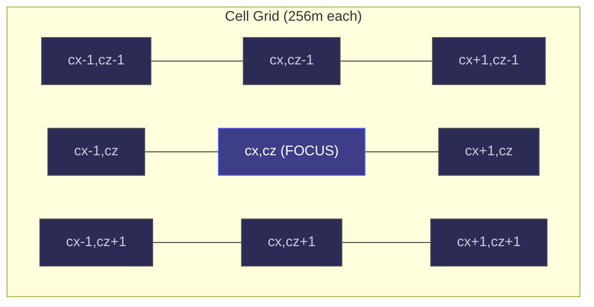
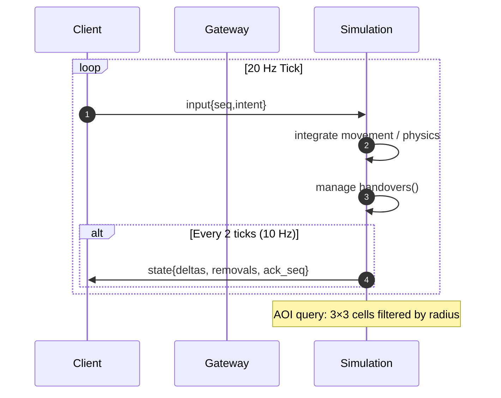
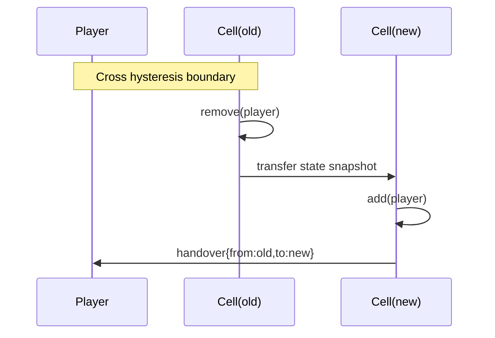
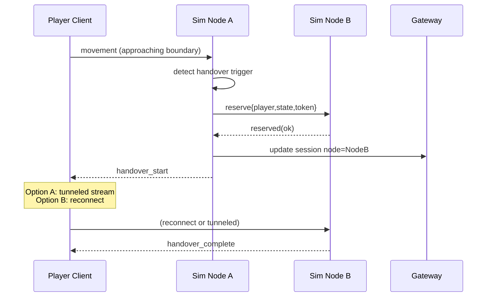

<!-- ───────────────────────────────────────────── -->
<!--                A S T R O S T E V E O          -->
<!-- ───────────────────────────────────────────── -->

<h1 align="center">🛰️ AstroSteveo</h1>
<p align="center">
  <strong>Software Engineer</strong> • Systems Re‑Inventor • World Model Tinkerer<br/>
  <em>"Reinventing the obvious until it's obviously better."</em>
</p>

<p align="center">
  
  
  _%20Repeat-ff6f3c?style=for-the-badge"/>
</p>

---

### 🌌 Core Identity

I challenge “defaults,” especially in spaces that pretend they’re solved (static sharding, brittle world partitioning, boilerplate infra).  
Patterns are raw material; I recombine patterns into infrastructure that disappears for the player but empowers the builder.

> Architectures should feel inevitable when finished — not when proposed.

---

### 🚧 Flagship: `prototype-game`

R&D playground for a next‑gen MMO backend where “Which server are you on?” becomes a deprecated question.

| Dimension | Snapshot |
|----------|----------|
| Goal | Seamless, fluid world state without static shard boundaries. |
| Core Services | Gateway (auth/session) • Simulation node (state + WebSocket transport). |
| Transport | WebSocket (gated via build tags / feature flags). |
| Design Style | Cell / region orchestration with adaptive load & continuity. |
| Language Focus | Go (infra + sim core) with targeted supporting tooling. |
| Docs Hub | Rich narrative across: <br/>• `docs/AGENTS.md`<br/>• `docs/architecture/technical-design-document.md`<br/>• `docs/development/`<br/>• `docs/product/` |
| Ops / Process | Makefile-driven reproducibility; automated local probe flows. |
| Ethos | “Treat simulation like living infrastructure; evolve via measurable constraints.” |

#### 🧪 Dev & Validation Ritual
```
make build
make fmt vet test test-ws        # Everything green or no merge
make run                         # Gateway :8080 • Sim :8081
curl :8080/healthz && curl :8081/healthz
TOKEN=$(make login)
make wsprobe TOKEN="$TOKEN"      # Join session + movement simulation
```
If it can’t survive this loop, it doesn’t ship.

---

### 🧬 Architecture Vignette (Curated)

(See full [Technical Design Document](docs/architecture/technical-design-document.md) for deep detail.)

1. Gateway = stateless front door (auth/session). Simulation = authoritative tick + AOI + handover.  
2. 256m cells, 128m AOI radius, hysteresis for stable handovers.  
3. 20 Hz tick integration, 10 Hz replication deltas.  
4. Early intentional cell semantics → future multi‑node scaling is a mechanical extension.  
5. Systems (inventory, skills, targeting) piggy‑back on the same replication delta pipeline.  
6. Bots maintain density to keep the world “breathing.”  
7. Observability first: tick cost, snapshot size, AOI density, handover latency.  
8. Performance budgets define acceptance—not vibes.  

> “Strategic scaffolding” beats premature abstraction.

---

### 🛠️ Architecture Milestones

<p align="center">
  
  
  
  
  
  
  
</p>

(Adjust colors as progress evolves: green=done, yellow=in progress, lightgrey=queued.)

---

### 🧯 Key Performance Budgets

| Concern | Target |
|---------|--------|
| Tick time (200 AOI ents) | < 25ms |
| Local handover | < 250ms |
| Cross-node (stretch) | < 500ms |
| Avg bandwidth / client | < 30KB/s |
| Snapshot jitter | ±20ms |
| Handover duplication | 0 occurrences over soak |

---

### 🧩 Architecture Diagrams

#### 1. World Partition & AOI Window


#### 2. Tick / Replication Pipeline


#### 3. Local Handover (Phase A)


#### 4. Cross-Node Handover (Phase B – Future)


---

### 🧭 Operating Principles

- Reinvent where leverage compounds; defer where commodity is fine.  
- Composable primitives > “God engines”.  
- Developer experience is throughput, not garnish.  
- World state is an ecosystem: observe → adapt → rebalance.  
- Documentation precedes code when complexity is systemic.  

---

### 🔁 Why Reinvention?

> “There’s always more robust libraries, etc — so if you aren’t reinventing the wheel, you’re probably already behind.”

Reinvention here isn’t novelty chasing; it’s removing constraints inherited from the assumptions of older hardware, networking, and monolith-era mental models.

---

### 🧠 Tooling & Stack Snapshot

```
Core Languages:   Go • Java • Rust • TypeScript • (React for surfaces)
Backend:          Quarkus (select JVM services) • WebSocket-driven session/sim channels
Infra Direction:  Nix(OS) • (K8s evolution via k8s-infra) • Makefile orchestration
Patterns:         Region / cell partitioning • Adaptive load routing • Real-time sync
Focus Threads:    State streaming • Low-latency simulation loops • Mutation-safe evolution
```

---

### 🛰️ Repositories in Active Orbit

| Repo | Role / Intent |
|------|---------------|
| `prototype-game` | Core experimental MMO infra & simulation stack. |
| `k8s-infra` | Evolving infrastructure journey for eventually running the prototype at scale (clusters, deployment patterns, operational philosophy). |
| `nixos-config` | Curated NixOS environment — reproducible workstation + dev ergonomics as infrastructure. |
| `agents.md` | Knowledge + control surface for automated helpers / intelligent operational agents (extends the philosophy of codified process). |

(Each has a narrative; maturity determines visibility.)

---

### 🧩 Potential Deep Dives (Enable Later)

- Cell handover + continuity guarantees
- Observability & health surfaces (latency ceilings, partition pressure)
- World scaling economics vs. traditional shard splits
- Nix + K8s pipeline for simulation-driven iteration loops

---

### ☄️ Flavor Bits

| Theme | Pick |
|-------|------|
| Motto | “Worlds aren’t hosted. They’re cultivated.” |
| Vibe | Playfully serious systems engineering. |
| Superpower | Converting fuzzy architectural intent into runnable scaffolds fast. |
| Ongoing Question | “How invisible can infrastructure become before it’s pure design space?” |

---

### 🤝 Collaboration

Interested in:
- Distributed simulation & state continuity
- Unshardable or fluid world models
- Tooling that reduces cognitive residue
- Experiment-first architecture

Open a discussion or a well‑formed issue in `prototype-game` / `k8s-infra`.

---

<p align="center"><sub>README = living system. Refactor without apology.</sub></p>
